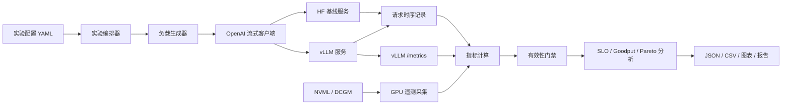
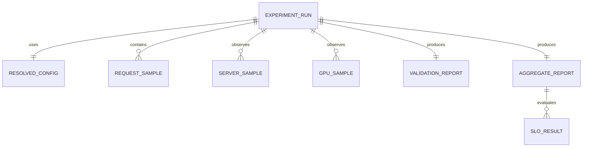
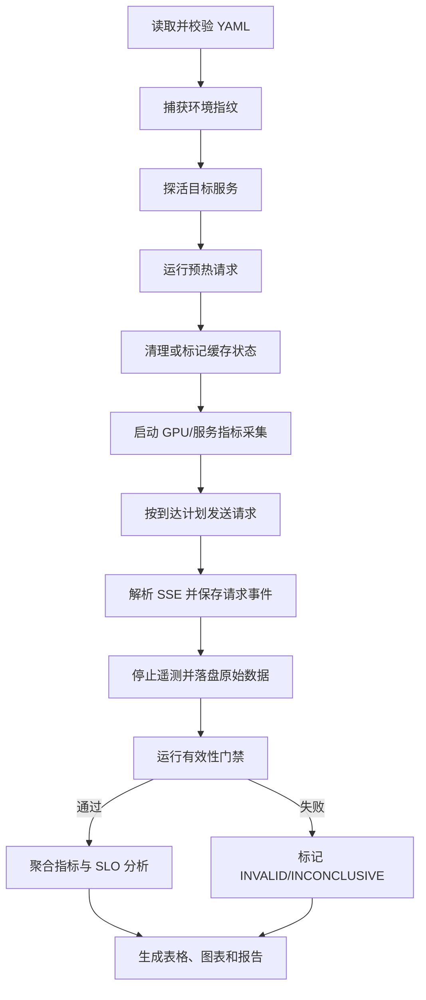
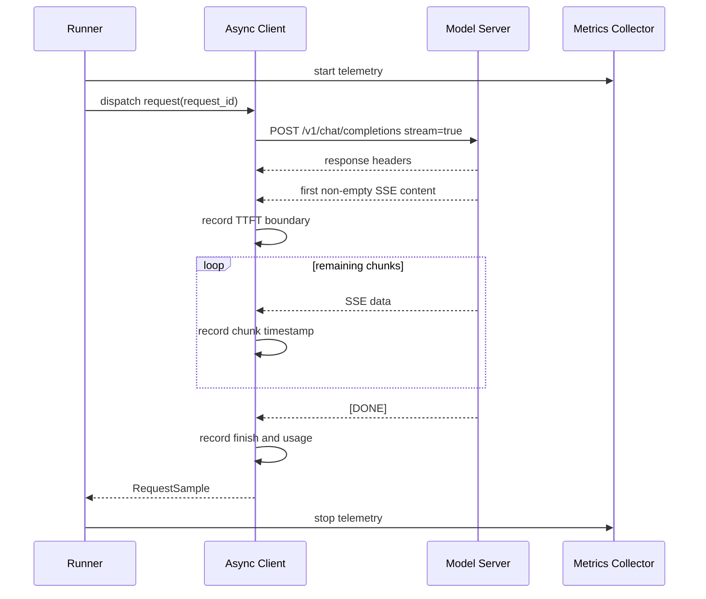

# InferScope 开发文档

> 文档版本：v1.0
> 最后更新：2026-08-12
> 当前进度：可运行 MVP（CPU 核心已验证，GPU 实测待 RTX 4060 环境）

## 一、项目概览

| 字段 | 内容 |
| --- | --- |
| 项目名称 | InferScope |
| 项目描述 | 面向 SLO 的大模型推理压测、诊断与配置调优平台 |
| 核心问题 | 在固定模型和 GPU 上，找到满足 TTFT/TPOT SLO 的最大 Goodput，并解释瓶颈 |
| 开发类型 | Python CLI + API 服务 + 实验分析工具 |
| 目标用户 | AI Infra 学习者、推理服务工程师、模型部署评估人员 |
| 开始时间 | 2026-08-12 |
| 当前状态 | 可运行 MVP；真实 vLLM/CUDA 性能实验待执行 |
| 预计周期 | 3～4 周，每天 2～3 小时 |
| 部署方式 | Linux + NVIDIA GPU，本机进程优先，Docker 为可复现交付方式 |
| 仓库地址 | 待初始化远端仓库 |
| 线上地址 | N/A，本项目首期不提供公网服务 |

### 1.1 求职导向

项目必须产生能够在 AI Infra 实习面试中展示的证据：

- 独立实现异步流式压测，而不是只调用现成 benchmark 命令；
- 明确定义 TTFT、TPOT、ITL、吞吐、尾延迟与 Goodput；
- 将客户端延迟、vLLM 调度/KV Cache 指标和 GPU 指标关联分析；
- 对预热、EOS、tokenizer、缓存污染和客户端瓶颈进行有效性检查；
- 使用固定环境、固定负载和原始结果完成可复现实验；
- 通过 Profiling 或指标证据解释优化原因和代价；
- 用 GuideLLM 或 vLLM benchmark 对自研工具进行交叉验证。

### 1.2 首期范围

首期包含：

- Hugging Face Transformers 基线服务；
- vLLM 推理服务启动和配置；
- OpenAI-compatible 流式请求客户端；
- 并发、固定速率和 Poisson 到达负载；
- 请求级、服务级和 GPU 级指标；
- Benchmark 有效性门禁；
- 配置扫描、SLO、Goodput 和 Pareto 分析；
- JSON/CSV/Markdown/PNG 实验产物；
- 单元测试、协议测试和 GPU 冒烟测试；
- Docker 与完整复现说明。

首期明确不包含：

- 聊天网页、登录、数据库和管理后台；
- RAG、Agent、微调和训练；
- Kubernetes、多机多卡和生产级自动扩缩容；
- 修改 vLLM 核心调度器；
- 同时维护多个推理框架适配；
- 没有实测依据的性能数字。

### 1.3 成功判定

项目交付必须回答三个问题：

1. 在给定模型、GPU 和负载下，服务的安全并发范围是多少？
2. 哪个配置能在指定 SLO 下获得最大 Goodput？
3. 性能变化来自请求排队、Prefill、Decode、KV Cache、GPU 资源还是客户端测量误差？

## 二、系统架构

### 2.1 整体架构图



### 2.2 运行边界

```text
控制面（CPU）
  Experiment Runner
    ├── 读取配置
    ├── 启停/探活目标服务
    ├── 生成请求计划
    ├── 采集客户端与服务端指标
    └── 输出实验产物

数据面（CPU + GPU）
  HF Baseline 或 vLLM
    ├── Tokenization
    ├── Prefill
    ├── Decode
    ├── KV Cache
    └── 流式响应

观测面（CPU）
  vLLM /metrics + NVML/DCGM
    ├── Running/Waiting Requests
    ├── KV Cache Usage/Hit Rate
    ├── GPU Utilization/Memory/Power
    └── 时间对齐后的样本
```

### 2.3 模块职责

| 模块 | 职责 | 不负责 |
| --- | --- | --- |
| `server` | 提供 HF 基线和服务探活 | 复杂业务逻辑、用户鉴权 |
| `transport` | HTTP、SSE 解析、连接与超时 | 指标聚合和报表 |
| `workloads` | 生成请求、到达时间和前缀结构 | 发送网络请求 |
| `metrics` | 计算请求级和聚合指标 | 修改原始事件 |
| `validators` | 判定实验是否可信 | 自动美化失败结果 |
| `telemetry` | 拉取 vLLM/GPU 指标并统一时间戳 | 推断未观测到的硬件事实 |
| `runner` | 编排 warm-up、测量、重复实验和清理 | 承担具体协议解析 |
| `analysis` | SLO、Goodput、Pareto、稳定性分析 | 删除或覆盖原始结果 |
| `reporting` | 生成 CSV、图表和 Markdown 报告 | 生成虚构结论 |

### 2.4 技术栈与版本策略

| 层级 | 技术 | 版本策略 | 用途 |
| --- | --- | --- | --- |
| 语言 | Python | 3.11.x | 主开发语言 |
| 张量框架 | PyTorch | 与目标 CUDA/vLLM 兼容的锁定版本 | HF 基线和 GPU 操作 |
| 推理框架 | Transformers | 锁定 patch 版本 | 基线模型加载 |
| 推理引擎 | vLLM | 锁定 patch 版本 | 高吞吐服务 |
| API 服务 | FastAPI + Uvicorn | 锁定 patch 版本 | HF 基线服务和探活 |
| HTTP 客户端 | httpx 或 aiohttp | 锁定 patch 版本 | 异步请求和 SSE |
| 配置 | Pydantic + PyYAML | 锁定 patch 版本 | 配置校验 |
| 数据分析 | Pandas + NumPy | 锁定 patch 版本 | 聚合和统计 |
| 图表 | Matplotlib | 锁定 patch 版本 | 离线图表 |
| GPU 采集 | pynvml，DCGM 可选 | 锁定 patch 版本 | 显存、利用率、功耗 |
| 监控 | Prometheus Client | 锁定 patch 版本 | 解析/导出指标 |
| 测试 | pytest + pytest-asyncio | 锁定 patch 版本 | 单元和异步测试 |
| 质量 | Ruff + MyPy | 锁定 patch 版本 | 格式、静态检查 |
| 交付 | Docker + NVIDIA Container Toolkit | 记录实际版本 | GPU 容器复现 |

所有精确 patch 版本在节点 1 根据实际 GPU、驱动和 CUDA 兼容性验证后写入锁文件，文档不得提前杜撰可用组合。

## 三、目录和数据设计

### 3.1 计划目录

```text
ai-infra-demo/
├── README.md
├── AI_INFRA_LEARNING_ROADMAP.md
├── DEV_DOCUMENT.md
├── INFERSCOPE_API.md
├── INFERSCOPE_STYLE.md
├── pyproject.toml
├── uv.lock                         # 或 requirements.lock
├── .env.example
├── configs/
│   ├── baseline.yaml
│   ├── concurrency_sweep.yaml
│   ├── prefix_cache.yaml
│   └── chunked_prefill.yaml
├── src/inferscope/
│   ├── cli.py
│   ├── config.py
│   ├── models.py
│   ├── runner.py
│   ├── server/
│   │   ├── hf_app.py
│   │   └── health.py
│   ├── transport/
│   │   ├── openai_client.py
│   │   └── sse.py
│   ├── workloads/
│   │   ├── synthetic.py
│   │   ├── arrival.py
│   │   └── shared_prefix.py
│   ├── metrics/
│   │   ├── request.py
│   │   ├── aggregate.py
│   │   └── definitions.py
│   ├── validators/
│   │   ├── experiment.py
│   │   └── token_counts.py
│   ├── telemetry/
│   │   ├── vllm_metrics.py
│   │   ├── gpu.py
│   │   └── sampler.py
│   ├── analysis/
│   │   ├── goodput.py
│   │   ├── pareto.py
│   │   └── stability.py
│   └── reporting/
│       ├── export.py
│       ├── charts.py
│       └── markdown.py
├── scripts/
│   ├── serve_hf.sh
│   ├── serve_vllm.sh
│   ├── run_benchmark.sh
│   └── capture_environment.sh
├── tests/
│   ├── unit/
│   ├── integration/
│   ├── contract/
│   ├── gpu/
│   └── fixtures/
├── docker/
│   ├── Dockerfile
│   └── compose.yaml
├── results/
│   ├── raw/.gitkeep
│   ├── processed/.gitkeep
│   └── charts/.gitkeep
└── reports/
    └── PERFORMANCE_REPORT.md
```

### 3.2 持久化方案

首期不使用数据库。每次实验创建不可变目录：

```text
results/raw/<run_id>/
├── manifest.json          # 环境、Git SHA、配置哈希、时间范围
├── config.resolved.yaml   # 解析默认值后的完整配置
├── requests.jsonl         # 每个请求的原始时序和结果摘要
├── server_metrics.jsonl   # vLLM 指标时间序列
├── gpu_metrics.jsonl      # GPU 指标时间序列
├── validation.json        # 有效性门禁结果
└── logs/                  # 目标服务和 runner 日志
```

处理后的聚合结果写入：

```text
results/processed/<run_id>/
├── summary.json
├── summary.csv
├── percentiles.csv
└── pareto.csv
```

### 3.3 产物关系图



### 3.4 核心数据对象

#### `ExperimentManifest`

| 字段 | 类型 | 说明 |
| --- | --- | --- |
| `schema_version` | string | 产物 Schema 版本 |
| `run_id` | string | UTC 时间 + 配置哈希组成的唯一 ID |
| `started_at` | datetime | 实验开始时间 |
| `finished_at` | datetime/null | 实验结束时间 |
| `git_commit` | string/null | 当前 Git SHA |
| `dirty_worktree` | boolean | 是否存在未提交修改 |
| `model_id` | string | 模型标识和 revision |
| `backend` | enum | `hf` 或 `vllm` |
| `hardware` | object | GPU、CPU、驱动等信息 |
| `software` | object | Python、CUDA、框架版本 |
| `config_sha256` | string | 完整配置哈希 |

#### `RequestSample`

| 字段 | 类型 | 说明 |
| --- | --- | --- |
| `request_id` | string | 请求唯一 ID |
| `scheduled_at_ns` | integer | 计划发送时间 |
| `started_at_ns` | integer | 单调时钟起点 |
| `first_content_at_ns` | integer/null | 首个非空内容块时间 |
| `finished_at_ns` | integer/null | 完成时间 |
| `input_tokens` | integer/null | 服务端优先、本地 tokenizer 兜底 |
| `output_tokens` | integer/null | 服务端优先、本地 tokenizer 兜底 |
| `chunk_times_ns` | integer[] | 每个有效 SSE 内容块到达时间 |
| `status` | enum | success/timeout/error/cancelled |
| `finish_reason` | string/null | 模型结束原因 |
| `error_code` | string/null | InferScope 错误码 |

原始 prompt 和完整模型输出默认不写入结果，避免意外保存敏感数据。测试数据需要审计时，只保存哈希、长度和截断摘要。

## 四、指标契约

### 4.1 时间来源

- 请求内持续时间必须使用 `time.perf_counter_ns()` 一类单调时钟；
- 跨进程样本关联使用 UTC wall clock，并记录采集端偏差；
- 不允许使用 `datetime.now()` 直接计算请求延迟；
- 所有内部持续时间以纳秒保存，报告阶段转换为毫秒。

### 4.2 请求级指标

```text
TTFT = first_content_at - request_started_at
E2E  = request_finished_at - request_started_at
TPOT = (E2E - TTFT) / (output_tokens - 1), output_tokens > 1
```

ITL 注意事项：SSE `data` 块不保证与 token 一一对应。因此：

- 原始客户端只报告 `chunk_interarrival`；
- 只有确认目标服务每个内容块对应一个 token 时，才将其标记为客户端 ITL；
- 默认正式 ITL 优先采用服务端 Prometheus 指标；
- 任何基于内容块近似得到的 ITL 必须标注 `proxy=true`。

### 4.3 聚合指标

```text
request_throughput = successful_requests / measured_wall_time
input_token_throughput = valid_input_tokens / measured_wall_time
output_token_throughput = valid_output_tokens / measured_wall_time
goodput = requests_meeting_all_slos / measured_wall_time
```

聚合必须同时报告样本数、均值、中位数、P95、P99、最小值和最大值。实验结论以 P95/P99 和 Goodput 为主，不以平均值代替尾延迟。

### 4.4 SLO 示例

```yaml
slo:
  ttft_p95_ms: 500
  tpot_p95_ms: 50
  success_rate_min: 0.99
```

该数值只是示例，不代表任何生产承诺。正式实验的 SLO 必须在报告中说明业务依据。

### 4.5 稳定性

- 每个主要配置至少重复 3 次；
- 报告中展示每次运行结果而非只保留最好一次；
- 稳态吞吐的变异系数目标不超过 10%；
- 超出目标时将结论标记为 `INCONCLUSIVE`，并检查温度、时钟、共享 GPU 和客户端负载；
- 不允许删除异常值，除非事先定义剔除规则并保留原始数据。

## 五、核心流程

### 5.1 单次实验流程



### 5.2 流式请求时序



### 5.3 配置扫描流程

1. 解析基础配置和候选参数；
2. 生成笛卡尔积，但设置最大组合数防止失控；
3. 为每个组合计算配置哈希；
4. 按确定顺序执行，必要时随机化执行顺序以降低温度漂移偏差；
5. 每个组合至少重复三次；
6. 将无效实验排除在 Pareto 计算之外，但保留并展示；
7. 按 Goodput 最大、TTFT/TPOT 更低、显存更低生成非支配集合；
8. 不自动宣称“最优”，只称“在当前搜索空间与环境下的最优观测配置”。

### 5.4 Benchmark 有效性门禁

| 门禁 | 默认规则 | 失败结果 |
| --- | --- | --- |
| 配置完整 | 必填项与范围通过 Pydantic 校验 | INVALID |
| 目标探活 | `/health` 或 `/v1/models` 可访问 | ABORTED |
| 预热完成 | 预热请求全部结束且不计入正式样本 | INVALID |
| 成功率 | 默认至少 99%，可由配置覆盖 | INVALID |
| 输出长度 | 实际输出长度在期望容差内 | INVALID 或单独报告 |
| Token 一致性 | 服务端与本地计数差异在阈值内 | INCONCLUSIVE |
| 缓存状态 | 冷/热缓存实验有明确标记和控制 | INCONCLUSIVE |
| 客户端容量 | 事件循环延迟和 CPU 未明显饱和 | INCONCLUSIVE |
| 时间完整 | 首块、结束、持续时间关系合法 | INVALID |
| 环境隔离 | GPU 无未知共享进程或已记录 | INCONCLUSIVE |
| 重复稳定 | 重复运行波动在目标范围 | INCONCLUSIVE |

## 六、标准实验矩阵

### 6.1 后端基线

| 实验 | 对照 | 实验组 | 固定条件 |
| --- | --- | --- | --- |
| E01 | HF 基线 | vLLM 默认配置 | 模型、dtype、输入输出、GPU |
| E02 | vLLM 并发 1 | 并发 2/4/8/16/32 | 模型与负载 |
| E03 | Prefix Cache 关闭 | Prefix Cache 开启 | 共享前缀与请求序列 |
| E04 | Chunked Prefill 关闭 | Chunked Prefill 开启 | 长输入混合负载 |

### 6.2 标准负载

| 名称 | 输入 token | 输出 token | 到达模式 | 目的 |
| --- | ---: | ---: | --- | --- |
| `short_chat` | 128 | 64 | concurrency/Poisson | 低延迟对话 |
| `normal_qa` | 1024 | 128 | concurrency/Poisson | 常规负载 |
| `long_document` | 4096 | 256 | Poisson | Prefill 阻塞 |
| `shared_prefix` | 2048 公共 + 128 独立 | 128 | session-aware | Prefix Cache |
| `mixed` | 按固定分布混合 | 按固定分布混合 | Poisson | 接近真实流量 |

### 6.3 可选实验

- BF16 与 FP16；
- BF16 与 AWQ/GPTQ INT4；
- 不同 `max-num-seqs`；
- 不同 `gpu-memory-utilization`；
- 客户端与服务端同机/异机的网络开销；
- Triton RMSNorm 或 Fused Softmax 微基准。

## 七、环境配置

### 7.1 最低环境

| 软件/硬件 | 最低要求 | 推荐 | 说明 |
| --- | --- | --- | --- |
| OS | Linux x86_64 | Ubuntu LTS | vLLM/CUDA 主运行环境 |
| Python | 3.11 | 3.11.x | 使用项目虚拟环境 |
| NVIDIA GPU | 能容纳目标模型 | 24GB 及以上更方便 | 首期单卡 |
| NVIDIA Driver | 与选定 CUDA 兼容 | 记录实际版本 | 不提前固定 |
| Docker | 支持 GPU 容器 | 最新稳定版 | 可选但建议 |
| 磁盘 | 30GB 可用 | 80GB 可用 | 模型与结果文件 |

没有 NVIDIA GPU 时，可以完成配置、指标、SSE、报告等 CPU 测试；正式性能结论必须在 Linux + NVIDIA GPU 上生成。

### 7.2 环境变量

```bash
# 服务
INFERSCOPE_HOST=127.0.0.1
INFERSCOPE_HF_PORT=8001
INFERSCOPE_VLLM_PORT=8000
INFERSCOPE_TARGET_URL=http://127.0.0.1:8000
INFERSCOPE_API_KEY=

# 模型
INFERSCOPE_MODEL_ID=Qwen/Qwen2.5-0.5B-Instruct
INFERSCOPE_MODEL_REVISION=
INFERSCOPE_DTYPE=auto
HF_HOME=./.cache/huggingface

# 实验与产物
INFERSCOPE_CONFIG=configs/baseline.yaml
INFERSCOPE_RESULTS_DIR=./results
INFERSCOPE_REPORTS_DIR=./reports
INFERSCOPE_RANDOM_SEED=20260812
INFERSCOPE_LOG_LEVEL=INFO

# 遥测
INFERSCOPE_VLLM_METRICS_URL=http://127.0.0.1:8000/metrics
INFERSCOPE_GPU_INDEX=0
INFERSCOPE_TELEMETRY_INTERVAL_MS=500
INFERSCOPE_CAPTURE_OUTPUT=false

# Hugging Face（需要私有或受限模型时才填写）
HF_TOKEN=
```

规则：

- `.env` 不得提交；
- `.env.example` 只能出现空值或公开示例；
- 日志与 manifest 必须对 API Key、HF Token 等字段脱敏；
- 默认绑定 `127.0.0.1`，除非用户明确配置远程访问；
- 模型 revision 为空时必须在 manifest 中记录实际解析到的 revision。

### 7.3 计划启动方式

```bash
# 1. 创建环境并安装依赖（具体命令由节点 1 固化）
python3.11 -m venv .venv
source .venv/bin/activate

# 2. 启动 vLLM
./scripts/serve_vllm.sh

# 3. 探活
curl http://127.0.0.1:8000/v1/models

# 4. 运行基线实验
./scripts/run_benchmark.sh configs/baseline.yaml

# 5. 查看结果
ls results/raw
ls reports
```

以上是接口级计划，直到脚本实现和 GPU 验证完成前，不声明命令已可运行。

## 八、错误码

| 错误码 | 类别 | 含义 | 是否重试 |
| --- | --- | --- | --- |
| `IS_CONFIG_INVALID` | 配置 | YAML 或字段范围错误 | 否，修复配置 |
| `IS_TARGET_UNAVAILABLE` | 服务 | 目标服务未就绪 | 有界重试 |
| `IS_REQUEST_TIMEOUT` | 请求 | 请求超过配置超时 | 由策略决定 |
| `IS_STREAM_MALFORMED` | 协议 | SSE 数据格式不合法 | 否，保留样本 |
| `IS_TOKEN_COUNT_MISMATCH` | 验证 | 服务端与本地 token 计数差异过大 | 否，标记不确定 |
| `IS_OUTPUT_LENGTH_INVALID` | 验证 | 实际输出长度不满足实验要求 | 否，标记无效 |
| `IS_WARMUP_FAILED` | 验证 | 预热请求失败 | 否，终止正式测试 |
| `IS_CACHE_STATE_UNKNOWN` | 验证 | 无法证明冷/热缓存状态 | 否，标记不确定 |
| `IS_CLIENT_SATURATED` | 验证 | 压测端成为瓶颈 | 否，降低负载或分机 |
| `IS_GPU_TELEMETRY_UNAVAILABLE` | 遥测 | GPU 指标不可用 | 可降级，但报告缺失 |
| `IS_RESOURCE_EXHAUSTED` | 资源 | OOM、端口耗尽或文件句柄不足 | 否，降低负载 |
| `IS_EXPERIMENT_INCONCLUSIVE` | 分析 | 波动或证据不足，不能下结论 | 重新设计实验 |

## 九、安全与成本检查

### 9.1 数据安全

- [ ] 默认不保存完整 prompt 和生成内容；
- [ ] 敏感 Header、环境变量和 CLI 参数写日志前脱敏；
- [ ] 原始产物不包含访问令牌；
- [ ] 远程服务必须显式允许并配置认证；
- [ ] 错误栈不得输出完整请求正文；
- [ ] 第三方数据集必须确认许可证和隐私边界。

### 9.2 服务安全

- [ ] 默认仅监听本机地址；
- [ ] 配置请求超时、最大并发和最大输出 token；
- [ ] 子进程使用明确 PID/进程组管理，不使用宽泛 kill 命令；
- [ ] 不自动下载和执行不受信任的 remote code；
- [ ] `trust_remote_code` 默认关闭；
- [ ] Docker 不以特权模式运行，GPU 权限按需开放。

### 9.3 GPU 成本

- [ ] 启动时打印预估实验组合数和最长运行时间；
- [ ] 配置最大实验组合数、最大请求数和最大持续时间；
- [ ] 支持 dry-run 展示计划但不发送请求；
- [ ] 云 GPU 实验结束后给出停止实例提醒；
- [ ] 失败时及时停止遥测和子进程；
- [ ] 不在程序中保存云平台密钥。

## 十、测试与质量门禁

### 10.1 测试层次

| 层次 | 运行环境 | 覆盖重点 |
| --- | --- | --- |
| Unit | CPU | 公式、百分位、SLO、配置、到达计划 |
| Contract | CPU | SSE、OpenAI 响应、错误事件、`[DONE]` |
| Integration | CPU | Fake Server + 并发客户端 + 产物生成 |
| GPU Smoke | NVIDIA GPU | HF/vLLM 单请求、流式响应、NVML |
| Benchmark Validation | NVIDIA GPU | 重复性、GuideLLM 趋势对比 |

### 10.2 关键测试用例

- `output_tokens=1` 时 TPOT 返回空值而不是除零；
- 空 SSE、keep-alive、多个 JSON 事件同包、UTF-8 分片；
- HTTP 429/500、超时、中途断流、客户端取消；
- 第一个事件只有 role 没有内容时不得提前记录 TTFT；
- 聚合吞吐使用实验 wall time，不使用请求耗时之和；
- 成功请求与有效请求分别计数；
- P95/P99 在小样本下遵循统一 quantile 方法；
- warm-up 样本不进入正式统计；
- 服务端 token count 优先级和本地兜底；
- 相同 seed 生成相同请求计划；
- 原始产物写入采用临时文件加原子 rename；
- 无 GPU 时 GPU 测试明确 skip，而不是假通过。

### 10.3 合并前门禁

```bash
ruff check .
ruff format --check .
mypy src
pytest -m "not gpu"
git diff --check
```

涉及 GPU、协议或指标口径的改动还必须运行对应 GPU/contract 测试。覆盖率目标：核心指标与验证模块不低于 90%，其余核心模块不低于 80%。

## 十一、开发节点规划

### 第一阶段：基础架构

- [x] 节点 1：项目脚手架、依赖锁定、配置模型和环境捕获
- [ ] 节点 2：HF 基线服务、健康检查和最小流式响应
- [ ] 节点 3：vLLM 启动脚本、探活和服务端指标发现（代码完成，GPU 待验证）

### 第二阶段：核心压测

- [x] 节点 4：OpenAI 异步客户端和健壮 SSE 解析
- [x] 节点 5：请求指标、聚合指标和结果 Schema
- [x] 节点 6：并发、固定速率、Poisson 和共享前缀负载

### 第三阶段：诊断与调优

- [x] 节点 7：Benchmark 有效性门禁
- [ ] 节点 8：vLLM 与 GPU 遥测采集、时间对齐（CPU/缺失降级已验证，GPU 待验证）
- [x] 节点 9：配置扫描、SLO、Goodput、Pareto 和稳定性分析

### 第四阶段：交付

- [ ] 节点 10：图表、性能报告、GuideLLM 交叉验证、Docker 和 README（报告/README/Docker 已完成）

### 可选扩展

- [ ] 节点 11：Triton RMSNorm 或 Fused Softmax，包含正确性与 benchmark
- [ ] 节点 12：SGLang 第二后端或 Kubernetes/DCGM 平台化

### 11.1 节点完成条件

每个节点必须同时满足：

1. 功能代码完成；
2. 对应测试通过；
3. 静态检查通过；
4. 相关文档同步；
5. 没有把凭证或大模型文件加入 Git；
6. 生成可审查的 diff；
7. 不把尚未运行的测试描述为通过。

## 十二、性能验收

由于 GPU、模型和软件版本尚未确定，本项目不预设绝对 tokens/s 或倍数。性能验收采用方法和证据标准：

- 自研压测与 GuideLLM/vLLM benchmark 的总体趋势一致；
- 关键指标口径经测试验证；
- 同配置重复结果达到稳定性目标，或明确标记不确定；
- 至少完成 E01～E04 四组实验；
- 至少找到一个有证据的瓶颈；
- 至少验证一项优化的收益和代价；
- 报告保留失败或无收益的实验；
- 所有结论限定于具体硬件、模型、版本与负载。

## 十三、最终交付物

- 可安装 Python 包和 CLI；
- HF 基线与 vLLM 启动脚本；
- 可复现的 YAML 实验配置；
- 自动化测试；
- 原始与处理后结果 Schema；
- 四组正式实验的原始数据和图表；
- `PERFORMANCE_REPORT.md`；
- Docker 配置；
- 完整 README；
- 3～5 分钟演示脚本；
- 面试问答提纲；
- 可选的上游 issue/PR 贡献记录。

## 十四、面试讲解主线

```text
为什么做：吞吐高不等于用户体验好
    ↓
怎么测准：单调时钟、SSE 边界、token count、warm-up、重复实验
    ↓
看到了什么：排队、KV Cache、GPU 与尾延迟如何变化
    ↓
怎么优化：一次只改一个配置，比较 Goodput 和 Pareto
    ↓
如何证明：原始数据、验证门禁、第三方工具交叉验证
    ↓
有什么局限：单机单卡、小模型、特定工作负载
```

## 十五、开发记录

开发已于 2026-08-12 正式开始。当前工作区尚未初始化 Git，因此提交列如实标记为“未提交”；不把本地文件误报为已发布仓库。

| 节点 | 状态 | 完成时间 | 提交 | 验证 |
| --- | --- | --- | --- | --- |
| 1、4～7、9 | 完成 | 2026-08-12 | 未提交 | Ruff、MyPy strict、CPU tests 通过 |
| 3、8 | 代码完成，GPU 待验证 | 2026-08-12 | 未提交 | CPU 降级与 fake-server E2E 通过 |
| 10 | 部分完成 | 2026-08-12 | 未提交 | 报告、SVG、README、Dockerfile 已完成；交叉验证待做 |
| 2 | 待开发 | — | — | HF Transformers 对照服务尚未实现 |

## 十六、已知风险与应对

| 风险 | 影响 | 应对 |
| --- | --- | --- |
| 没有 NVIDIA GPU | 无法形成正式性能结论 | CPU 完成工具开发，租用 GPU 进行短时正式实验 |
| CUDA/vLLM 版本不兼容 | 环境搭建失败 | 优先使用官方容器，记录镜像 digest |
| 模型提前 EOS | 输出长度不可控 | 设置合理生成参数并由有效性门禁检查 |
| SSE 块不等于 token | ITL 计算失真 | 区分 chunk inter-arrival 与 server ITL |
| Prefix Cache 污染 | 对照实验失真 | 明确冷/热状态、固定顺序或清理缓存 |
| 客户端成为瓶颈 | 低估服务性能 | 监控客户端 CPU/事件循环，必要时分机压测 |
| 云 GPU 波动 | 重复性差 | 预热、重复、监控温度/功耗、保留全部运行 |
| 项目范围膨胀 | 无法按期交付 | 首期只支持 HF/vLLM 和单卡，不做 UI/K8s |
| 只会调参数 | 面试深度不足 | 自研指标/验证模块，并解释源码调用链和协议边界 |
