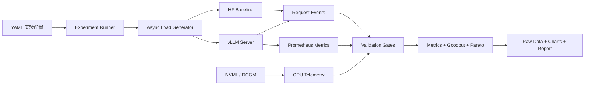

# InferScope 项目立项书

> 项目名称：InferScope
> 项目副标题：面向 SLO 的大模型推理压测、诊断与配置调优平台
> 立项日期：2026-08-12
> 项目阶段：可运行 MVP，真实 GPU 实验待完成
> 预计周期：3～4 周

## 1. 立项背景

大模型能够成功启动，并不代表推理服务具备可接受的性能。在真实并发场景中，系统需要同时处理：

- 首 token 等待时间；
- 持续生成速度；
- 请求排队与尾延迟；
- Prefill 和 Decode 的资源竞争；
- KV Cache 显存占用和缓存命中；
- 并发提升带来的吞吐—延迟权衡；
- 压测客户端、tokenizer 和预热过程造成的测量误差。

现有开源工具已经覆盖其中很多能力，但直接调用工具只能证明“会使用命令”。本项目选择实现一个范围受控的核心压测与验证系统，再使用成熟工具交叉验证，从而形成适合 AI Infra 实习求职展示的完整工程闭环。

## 2. 项目目标

### 2.1 核心目标

在固定模型、GPU 和工作负载下：

1. 测量 TTFT、TPOT、尾延迟、吞吐、显存和错误率；
2. 判断一次 benchmark 是否具备比较价值；
3. 找到满足指定 SLO 的最大 Goodput；
4. 关联请求、服务端和 GPU 指标解释瓶颈；
5. 输出可复现的原始数据、图表和技术报告。

### 2.2 求职目标

项目需要证明以下能力：

| 岗位能力 | 项目证据 |
| --- | --- |
| Python 工程能力 | 异步客户端、配置系统、数据模型、测试与 CLI |
| Linux/服务部署 | HF/vLLM 服务、进程、端口、环境和 Docker |
| PyTorch/Transformer | HF 基线、tokenizer、Prefill/Decode、KV Cache |
| 推理框架 | vLLM 服务、配置、指标和调度现象分析 |
| 性能工程 | 单调时钟、预热、重复实验、尾延迟和 Goodput |
| 可观测性 | vLLM Prometheus 指标与 NVML/DCGM GPU 遥测 |
| 问题定位 | 有效性门禁、瓶颈假设和证据链 |
| 沟通表达 | README、性能报告、演示视频和面试讲稿 |

### 2.3 非目标

首期不追求：

- 自研完整推理引擎；
- 生产级多租户平台；
- Kubernetes、多机多卡和自动扩缩容；
- 训练、微调、RAG 和 Agent；
- 漂亮但与性能主线无关的 Web UI；
- 在未实测前承诺具体提升倍数。

## 3. 核心问题定义

项目围绕一个可验证问题展开：

> 对于给定模型、单张 GPU 和指定输入/输出长度分布，哪一组 vLLM 配置能在 TTFT、TPOT 和成功率 SLO 下实现最高 Goodput？

示例 SLO：

```yaml
ttft_p95_ms: 500
tpot_p95_ms: 50
success_rate_min: 0.99
```

示例值仅用于说明系统能力，不代表生产服务承诺。正式实验必须说明阈值来源。

## 4. 开源方案调研与决策

### 4.1 候选项目

| 项目 | 参考价值 | 决策 |
| --- | --- | --- |
| vLLM | 推理后端、Continuous Batching、Paged KV Cache、Prometheus 指标 | 首期核心依赖 |
| GuideLLM | 流量模式、TTFT/ITL 分布、标准报告 | 用于交叉验证 |
| AIPerf | Goodput、SLO、参数扫描、真实流量和 GPU Telemetry | 借鉴方法，不复刻架构 |
| SGLang | Radix Cache、共享前缀、第二推理框架 | 第二阶段可选 |
| DCGM Exporter | GPU Prometheus 遥测 | 首期 NVML，后续可接入 |
| Liger Kernel | Triton Kernel 的测试和 benchmark 组织 | 可选加分项 |
| Vidur | 推理系统仿真和调度研究 | 首期不纳入 |
| llm-d-benchmark | Kubernetes 和大规模推理 benchmark | 首期不纳入 |

### 4.2 自研与复用边界

自己实现：

- 异步 OpenAI 流式压测客户端；
- SSE 解析和请求时序记录；
- 指标计算和聚合；
- Benchmark 有效性门禁；
- 配置扫描、Goodput 和 Pareto 分析；
- 实验产物和报告生成。

直接复用：

- vLLM 模型执行和服务；
- Hugging Face 模型与 tokenizer；
- Prometheus 文本协议库；
- NVML/DCGM 硬件指标能力；
- Pandas/NumPy/Matplotlib 基础统计与绘图。

交叉验证而非嵌入：

- GuideLLM；
- vLLM 自带 benchmark；
- 可选 AIPerf。

## 5. 产品范围

### 5.1 P0：必须完成

- HF 基线服务；
- vLLM 启动与探活；
- OpenAI-compatible 流式请求；
- 固定并发负载；
- TTFT、TPOT、E2E、吞吐、成功率；
- JSONL 原始结果；
- 有效性门禁；
- 单元测试和协议测试。

### 5.2 P1：求职展示完整度

- 固定速率与 Poisson 到达；
- 共享前缀和长输入负载；
- vLLM `/metrics`；
- GPU 利用率、显存和功耗；
- SLO、Goodput 和 Pareto；
- 参数矩阵扫描；
- CSV、图表和 Markdown 报告；
- GuideLLM 交叉验证；
- Docker 与复现文档。

### 5.3 P2：时间允许再做

- BF16/FP16/INT4 对比；
- Triton RMSNorm 或 Fused Softmax；
- SGLang 第二后端；
- DCGM + Prometheus/Grafana；
- 简化调度模拟器；
- 向上游提交 issue 或 PR。

P0、P1 没完成前不得启动 P2。

## 6. 用户故事

### US-01：建立基线

作为学习者，我希望用同一模型和同一负载测试 HF 与 vLLM，从而观察推理引擎带来的系统级差异。

验收：能够生成包含环境、请求和指标的可比较报告。

### US-02：发现安全并发

作为部署工程师，我希望扫描并发 1/2/4/8/16/32，从而找到吞吐继续增长但尾延迟已经恶化的拐点。

验收：生成吞吐—TTFT/TPOT 曲线和 SLO Goodput 表。

### US-03：验证缓存优化

作为推理工程师，我希望比较 Prefix Cache 开关，从而判断共享前缀负载下的收益和显存代价。

验收：能够证明冷/热缓存状态，记录命中率并保留对照数据。

### US-04：验证长 Prefill 调度

作为推理工程师，我希望比较 Chunked Prefill 开关，从而观察长请求是否阻塞短请求。

验收：混合负载中分别报告长短请求的 TTFT 与 Goodput。

### US-05：拒绝错误结论

作为性能测试人员，我希望系统发现 tokenizer 不一致、输出过短、预热污染或客户端饱和，从而避免生成误导性的提升百分比。

验收：无效实验保留原始数据，但不得进入 Pareto 或正式结论。

## 7. 系统方案



详细架构和模块边界见 [DEV_DOCUMENT.md](./DEV_DOCUMENT.md)。

## 8. 标准实验

### 8.1 固定负载

| 名称 | 输入 token | 输出 token | 目标 |
| --- | ---: | ---: | --- |
| 短对话 | 128 | 64 | 低延迟 |
| 普通问答 | 1024 | 128 | 常规吞吐 |
| 长文档 | 4096 | 256 | Prefill 压力 |
| 共享前缀 | 2048 公共 + 128 独立 | 128 | Prefix Cache |

### 8.2 首期实验

| 编号 | 实验 | 唯一主要变量 |
| --- | --- | --- |
| E01 | HF 对比 vLLM | 推理后端 |
| E02 | 并发扫描 | 并发数 |
| E03 | Prefix Cache A/B | 缓存开关 |
| E04 | Chunked Prefill A/B | Prefill 策略 |

每个主要配置至少运行三次，报告全部结果和波动，不只保留最好一次。

## 9. 开发计划

| 周期 | 目标 | 关键交付 |
| --- | --- | --- |
| 第 1 周 | 跑通服务和流式链路 | 脚手架、HF、vLLM、SSE 客户端 |
| 第 2 周 | 测准并验证 | 指标、负载、结果 Schema、门禁、测试 |
| 第 3 周 | 诊断和调优 | 遥测、参数扫描、Goodput、四组实验 |
| 第 4 周 | 求职交付 | 报告、图表、Docker、交叉验证、演示材料 |

具体分为 10 个开发节点，见 [DEV_DOCUMENT.md](./DEV_DOCUMENT.md)。

## 10. 验收标准

### 10.1 功能验收

- [ ] 一条命令启动目标服务；
- [ ] 一条命令运行配置化实验；
- [ ] 支持流式 TTFT；
- [ ] 支持并发与 Poisson 负载；
- [ ] 保存请求、服务和 GPU 原始指标；
- [ ] 自动执行有效性门禁；
- [ ] 自动生成 Goodput/Pareto 和报告。

### 10.2 质量验收

- [ ] 指标公式和边界均有单元测试；
- [ ] SSE 分片、断流、错误事件有 contract 测试；
- [ ] CPU 测试通过；
- [ ] GPU 功能在真实 NVIDIA GPU 验证；
- [ ] 自研压测与 GuideLLM 趋势基本一致；
- [ ] README 可由陌生开发者复现；
- [ ] 结果可追溯到配置哈希、环境和 Git SHA。

### 10.3 性能验收

不设置脱离硬件环境的绝对速度门槛。必须：

- 完成 E01～E04；
- 找到至少一个有证据的性能瓶颈；
- 验证至少一项优化的收益和代价；
- 保留失败、退化和不确定实验；
- 结论明确限定硬件、模型、版本和负载。

## 11. 风险与控制

| 风险 | 控制措施 |
| --- | --- |
| 没有 GPU | CPU 完成工具开发，短时租用 GPU 做正式实验 |
| 环境兼容失败 | 官方容器优先，锁定镜像和依赖版本 |
| 测量结果不可信 | 有效性门禁、重复实验、第三方交叉验证 |
| 项目范围过大 | P0/P1/P2 分级，首期只支持单卡 HF/vLLM |
| GPU 成本失控 | dry-run、组合上限、请求/时长上限 |
| 没有优化收益 | 保留结果，解释瓶颈与假设错误，同样形成技术材料 |
| 面试只会讲参数 | 掌握协议、指标公式、调用链和验证边界 |

## 12. 最终交付

- 项目源码；
- 自动化测试；
- Docker/环境配置；
- 四组实验原始数据；
- 图表与性能报告；
- 开发、接口、规范文档；
- 3～5 分钟演示视频脚本；
- 简历项目描述；
- 10～15 个面试追问及答案；
- 可选开源 issue/PR。

## 13. 简历描述模板

在完成真实实验前，所有数字保留占位符：

> 设计并实现面向 SLO 的 LLM 推理压测与配置调优平台，支持 Hugging Face/vLLM、异步流式压测及 TTFT、TPOT、P99、Goodput 与 GPU 指标采集；通过 benchmark 有效性门禁识别预热、EOS、tokenizer 和缓存污染问题，并在 `[GPU/模型/负载]` 下通过 `[优化方案]` 将 `[指标]` 从 `[X]` 改善至 `[Y]`。

禁止在没有对应原始 run ID 和报告时填写数字。

## 14. 文档索引

- [AI_INFRA_LEARNING_ROADMAP.md](./AI_INFRA_LEARNING_ROADMAP.md)：学习路线；
- [DEV_DOCUMENT.md](./DEV_DOCUMENT.md)：系统架构、节点、环境与验收；
- [INFERSCOPE_API.md](./INFERSCOPE_API.md)：HTTP、SSE、CLI 和结果 Schema；
- [INFERSCOPE_STYLE.md](./INFERSCOPE_STYLE.md)：代码、测试和实验规范。

## 15. 立项结论

InferScope 首期以“测准、解释、复现”为核心，不追求功能堆砌。项目完成后应当能够用真实数据回答：

> 什么配置在当前环境下最好、为什么、在什么条件下成立、付出了什么代价，以及这个结论为什么可信。

本立项自 2026-08-12 起生效。任何扩大范围的需求必须先评估是否影响 P0/P1 交付，再更新本文档和开发计划。
