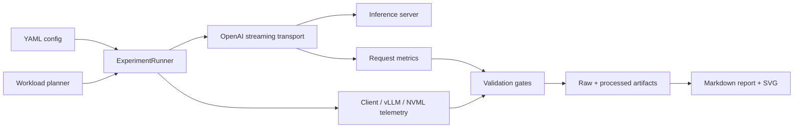

# InferScope

> 面向 OpenAI 兼容大模型服务的、SLO-aware 推理基准测试与证据归档工具。

InferScope 把请求级时延、SLO Goodput、实验有效性、环境指纹和可复核产物放进同一条流水线，用于展示 LLM inference benchmark 方法，而不是替代推理引擎。

[快速开始](#快速开始) · [架构](docs/ARCHITECTURE.md) · [方法论](docs/BENCHMARK_METHODOLOGY.md) · [配置](docs/CONFIGURATION.md) ·
[RTX 4060 实验](docs/RTX4060_GUIDE.md) · [面试问答](docs/INTERVIEW_QA.md)

## 30 秒了解 InferScope

- **输入**：OpenAI Chat Completions 兼容服务、YAML 实验配置和 SLO 阈值。
- **执行**：按并发、固定速率或 Poisson 到达模型发送流式请求，同时采集客户端、
  vLLM Prometheus 和可选 NVML 遥测。
- **输出**：请求明细、聚合指标、有效性判定、环境清单、Markdown 报告和 SVG 图表。
- **与普通压测的区别**：无效实验不会被包装成性能结论；吞吐之外还计算 TTFT、TPOT、
  E2E、成功率和满足时延 SLO 的 Goodput。

状态口径在整个项目中一致：

| 状态 | 含义 |
| --- | --- |
| **Verified** | 已在当前开发环境真实运行，并有测试或本地产物证据 |
| **Implemented** | 代码与测试已存在，但尚未在目标 GPU 环境验证 |
| **Planned** | 尚未实现，不应当作已有能力描述 |

**当前事实：CPU fake-server smoke 已验证；RTX 4060 真实性能尚无可发布数据。**

## 快速开始

要求 Python 3.11–3.13，并推荐使用 [uv](https://docs.astral.sh/uv/)。

```bash
git clone https://github.com/zhengwenze/ai-infra-demo.git
cd ai-infra-demo
uv sync --all-groups
```

终端 A 启动只用于链路验证的本地 fake server：

```bash
./scripts/serve_fake.sh
```

终端 B 运行 smoke benchmark：

```bash
./scripts/run_smoke.sh
```

查看某次运行的校验与聚合结果：

```bash
uv run inferscope benchmark show \
  --run-id <run-id> \
  --results-dir results
```

> fake server 只能证明请求、计时、聚合、校验和报告链路可运行，不能代表 GPU 或真实模型性能。
> RTX 4060 的环境准备与运行方法见 [RTX 4060 实验指南](docs/RTX4060_GUIDE.md)。

## 当前证据状态

| 能力或结论 | 状态 | 当前证据 |
| --- | --- | --- |
| CPU fake-server 端到端 smoke | **Verified** | integration tests 与本地 smoke 产物 |
| SSE 增量解析、请求计时、指标聚合 | **Verified** | unit / contract / integration tests |
| 配置校验、有效性门禁、产物落盘 | **Verified** | unit / integration tests |
| vLLM `/metrics` 解析与 NVML 采集 | **Implemented** | 代码与模拟输入测试 |
| RTX 4060 + Qwen2.5-0.5B-Instruct 实验入口 | **Implemented** | 脚本和配置已准备，尚无真实 GPU 产物 |
| Hugging Face backend、公平 A/B 对比 | **Planned** | 当前 runner 只执行 OpenAI Chat Completions |
| 自动参数搜索与回归门禁 | **Planned** | 尚无 CLI 工作流 |

### 示例结果应该怎样阅读

CPU smoke 会遍历并发 `1 / 2 / 4`，每个实验生成请求/遥测 JSONL、`validation.json`、
`aggregate.json` 和 Markdown 报告。它的价值是验证证据链，不是提供可比较的性能数字。

真实 RTX 4060 结果区目前有意保持为空：

| GPU | 模型 | 配置 | TTFT / TPOT / Goodput | 结论 |
| --- | --- | --- | --- | --- |
| RTX 4060 8 GB | Qwen2.5-0.5B-Instruct | 待实测 | **无已验证数据** | 不作性能声明 |

未来发布结果时，必须同时提交环境清单、原始请求明细、校验状态、聚合摘要和图表；规则见
[结果证据说明](docs/results/README.md)。

## 核心能力

- **流式请求测量**：解析跨 chunk SSE，分别记录连接开始、首个有效 token 和结束时间。
- **三种负载模型**：闭环并发、固定请求速率、带 seed 的 Poisson 到达。
- **SLO-aware 指标**：TTFT、TPOT、E2E、请求吞吐、token 吞吐、成功率和 Goodput。
- **实验有效性门禁**：检查预热、成功率、计时完整性、输出长度、token 可用性、
  客户端 event-loop lag 和 GPU 隔离状态。
- **多源遥测**：客户端单调时钟、vLLM Prometheus 指标和可选 NVML GPU 采样。
- **证据优先产物**：原始样本、运行清单、聚合结果、验证报告、Markdown 摘要和 SVG 图。

## 自研边界与复用边界

本项目的工作量不在“复制一个 vLLM benchmark 脚本”，而在把测试方法变成可审计的工程闭环。

| 自研部分 | 复用部分 |
| --- | --- |
| 到达计划、SSE 状态机与请求级计时 | vLLM 等提供 OpenAI 兼容推理服务 |
| 指标定义、聚合、SLO Goodput | `httpx` 提供异步 HTTP 传输 |
| 有效性判定与错误状态 | Pydantic / PyYAML 提供配置解析与校验 |
| 环境指纹、遥测适配与证据产物 | Prometheus 文本格式与 NVML 作为观测接口 |
| 报告、图表和可复现实验脚本 | Typer / Rich 提供 CLI 交互 |

InferScope 不修改模型权重、CUDA kernel、vLLM scheduler 或 KV cache 实现；它负责在这些系统之上
构建“怎么压、怎么量、结果是否可信、证据如何复核”的实验基础设施。

## 架构概览



一次 `benchmark run` 会为配置中的每个负载点建立到达计划，执行 warmup，再测量正式请求；
随后聚合指标、计算 Goodput、执行有效性门禁并写出证据。完整组件关系和失败路径见
[架构文档](docs/ARCHITECTURE.md)。

## 指标口径

| 指标 | 本项目口径 |
| --- | --- |
| TTFT | 发起请求到首个非空内容 token 的单调时钟差 |
| TPOT | 首 token 后的生成时间除以后续输出 token 数 |
| E2E | 发起请求到流结束 |
| Request throughput | 成功请求数 / 测量窗口秒数 |
| Token throughput | 成功请求输出 token 总数 / 测量窗口秒数 |
| Goodput | 同时满足 TTFT、TPOT 和运行级成功率 SLO 的请求速率 |

TPOT 需要至少两个输出 token；小样本 P99 只能用于链路检查。公式、百分位实现、测量窗口和
有效性规则以 [Benchmark 方法论](docs/BENCHMARK_METHODOLOGY.md) 为准。

## 产物与可复现性

默认机器产物与报告目录：

```text
results/
├── raw/<run-id>/
│   ├── manifest.json
│   ├── config.resolved.yaml
│   ├── requests.jsonl
│   ├── client_metrics.jsonl
│   ├── server_metrics.jsonl
│   ├── gpu_metrics.jsonl
│   └── validation.json
├── processed/<run-id>/
│   ├── aggregate.json
│   └── summary.csv
└── charts/<experiment>.svg

reports/generated/
└── <run-id>.md
```

`manifest.json` 保存无密钥环境指纹和配置哈希，`config.resolved.yaml` 保存解析后配置，
`requests.jsonl` 保存请求级测量，
`validation.json` 决定结果是 `VALID`、`INVALID` 还是 `INCONCLUSIVE`。生成目录默认不提交，
避免把本机临时结果伪装成公开基准数据。

## 项目结构

```text
src/inferscope/
├── transport/    # OpenAI 流式客户端与 SSE 解析
├── workloads/    # 到达计划与 prompt 生成
├── metrics/      # 请求级和聚合指标
├── telemetry/    # vLLM / NVML / 客户端采样
├── validators/   # 实验有效性门禁
├── analysis/     # Goodput、Pareto、稳定性分析
├── reporting/    # JSON / CSV / Markdown / SVG
├── config.py     # 严格 YAML schema
├── runner.py     # 端到端实验编排
└── cli.py        # env / server / benchmark 命令
```

## 测试与质量门禁

本地非 GPU 门禁：

```bash
uv run pytest -m "not gpu" -q
uv run ruff check .
uv run ruff format --check .
uv run mypy src
uv build
bash -n scripts/*.sh
```

测试分为 unit、contract 和 integration；GPU 测试单独标记，不能由 CPU mock 代替。目前仓库
**没有 GitHub Actions 工作流，因此没有 CI 已通过的声明或徽章**。开发约定和扩展流程见
[开发指南](docs/DEVELOPMENT.md)。

## RTX 4060 8 GB 路线

仓库提供保守配置 `configs/rtx4060_qwen05b.yaml` 和启动脚本
`scripts/serve_vllm_4060.sh`。默认使用小模型、`max-model-len=4096`、
`gpu-memory-utilization=0.80`、`max-num-seqs=8`，用于降低首次实验的 OOM 风险。

这意味着“实验入口已实现”，不意味着“8 GB 卡上已验证”。真实运行前请阅读
[RTX 4060 指南](docs/RTX4060_GUIDE.md)，并保留失败实验与环境差异。

## 当前限制

1. 尚无可提交的 RTX 4060 真实基准产物，不能给出 GPU 性能结论。
2. runner 当前只执行 Chat Completions；配置中的 HF backend 与 completions 尚未接线。
3. `mixed` workload、prompt/response 保存开关和多输出格式尚未形成完整执行路径。
4. token 数依赖服务端 usage；本地 tokenizer 与 token mismatch 门禁尚未接入。
5. Pareto 与稳定性算法已有实现，但还没有完整 CLI 报告入口。
6. GPU “干净环境”无法自动充分证明；缺少证据时结果会是 `INCONCLUSIVE`。
7. 当前没有 CI、正式 release 和已验证的容器镜像发布流程。

## 近期路线图

- 在 RTX 4060 8 GB 上跑完固定环境的 Qwen2.5-0.5B 实验并发布完整证据包。
- 把 token mismatch、GPU 隔离和 `/metrics` 缺失提升为更清晰的验证证据。
- 将 Pareto frontier 与多次重复稳定性分析接入 CLI 和报告。
- 实现独立 backend adapter 后，再进行 vLLM 与 Hugging Face 公平对照。
- 添加 GitHub Actions 非 GPU 门禁，并在真实验证后发布可引用的 release。

## 文档导航

| 文档 | 负责回答的问题 |
| --- | --- |
| [架构](docs/ARCHITECTURE.md) | 模块如何协作，数据与状态如何流动？ |
| [Benchmark 方法论](docs/BENCHMARK_METHODOLOGY.md) | 指标怎么算，什么时候结果才有效？ |
| [配置与 CLI](docs/CONFIGURATION.md) | 当前哪些命令和 YAML 字段真的可用？ |
| [RTX 4060 指南](docs/RTX4060_GUIDE.md) | 如何在 8 GB NVIDIA GPU 上完成首次真实实验？ |
| [开发指南](docs/DEVELOPMENT.md) | 如何测试、扩展和维护项目？ |
| [结果证据](docs/results/README.md) | 发布性能结论必须附带哪些文件？ |
| [项目立项](docs/PROJECT_PROPOSAL.md) | 为什么做、范围是什么、下一步是什么？ |
| [项目面试问答](docs/INTERVIEW_QA.md) | 如何基于真实代码解释设计与局限？ |
| [AI Infra 学习路线](docs/LEARNING_ROADMAP.md) | 如何围绕求职补齐基础与项目能力？ |
## License

项目元数据声明为 Apache-2.0；仓库当前尚缺独立 `LICENSE` 文件，正式发布前需要补齐。
