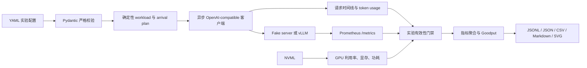

# InferScope

> 面向大语言模型在线推理服务的 SLO-aware 基准测试、实验有效性校验与证据化报告工具。

[GitHub 仓库](https://github.com/zhengwenze/ai-infra-demo) · [开发文档](DEV_DOCUMENT.md) · [API 设计](INFERSCOPE_API.md) · [项目立项](PROJECT_PROPOSAL.md)

InferScope 不只回答“每秒能处理多少请求”，还会同时记录 **TTFT、TPOT、端到端延迟、吞吐、成功率、Goodput、vLLM 指标与 GPU 遥测**，并判断一次实验是否具备比较价值。项目当前已打通 CPU 假服务端的完整链路，并为 Linux + NVIDIA RTX 4060 8GB + vLLM 准备了保守配置；真实 GPU 性能数据仍需在对应硬件上采集。

## 项目状态

| 项目 | 当前状态 |
| --- | --- |
| OpenAI-compatible 流式请求与 SSE 解析 | 已实现，并有契约测试 |
| 并发、固定速率、Poisson 到达模型 | 已实现 |
| TTFT、TPOT、E2E、吞吐、成功率、Goodput | 已实现 |
| vLLM Prometheus 指标与 NVML GPU 遥测采集 | 已实现；无 GPU 时显式记录不可用 |
| 实验有效性门禁与 `VALID / INVALID / INCONCLUSIVE / ABORTED` 状态 | 已实现 |
| JSONL、JSON、CSV、Markdown、SVG 证据产物 | 已实现 |
| CPU 本地端到端 smoke test | 已验证 |
| RTX 4060 8GB + vLLM 实测 | 脚本和配置已提供，当前开发机未验证 |
| Transformers 基线、GuideLLM 交叉验证、自动调参 | 规划中，尚未实现 |

> 面试或简历中请把“已实现的测量系统”和“尚待 GPU 实验验证的性能结论”分开表述。CPU 假服务端只用于验证链路正确性，不能作为真实模型性能数据。

## 为什么需要 InferScope

普通压测工具很容易给出一个漂亮但不可复现的吞吐数字，例如：

- 输入和输出长度没有固定，导致不同实验并非同一工作量；
- 请求失败、客户端卡顿或 GPU 被其他进程占用，却仍然生成结论；
- 把 SSE 数据块当作模型 token，错误计算 token 间隔；
- 只比较吞吐，不检查首 token 延迟与逐 token 延迟是否满足在线服务 SLO；
- 没有保存配置、环境和原始样本，事后无法解释结果。

InferScope 将一次 benchmark 视为一项需要证据链的实验：先固定配置和随机种子，再执行 warmup 与负载矩阵，同时采集客户端、服务端和 GPU 遥测，随后执行有效性门禁，最后生成可复核的结构化产物与报告。

## 核心能力

### 1. 可重复的负载模型

- `concurrency`：闭环并发，适合观察不同并发数下的吞吐与延迟拐点；
- `fixed_rate`：固定请求速率，适合模拟稳定到达流量；
- `poisson`：带固定 seed 的 Poisson 到达，适合模拟更接近线上随机到达的请求；
- `synthetic`：确定性合成 prompt；
- `shared_prefix`：共享前缀 workload，为后续验证 prefix cache 收益提供基础。

### 2. OpenAI-compatible 流式传输

客户端请求 `/v1/chat/completions`，支持跨 TCP chunk 的 SSE 事件重组、`[DONE]` 结束标记、usage token 提取、超时与错误分类。Bearer token 只从环境变量读取，不写入配置快照或日志。

### 3. 指标口径

| 指标 | 定义 | 说明 |
| --- | --- | --- |
| TTFT | `first_non_empty_content_time - request_start_time` | 首个非空内容到达时间 |
| E2E latency | `request_finish_time - request_start_time` | 请求端到端耗时 |
| TPOT | `(E2E - TTFT) / (output_tokens - 1)` | 输出 token 小于等于 1 时不计算 |
| Request throughput | `successful_requests / measured_wall_time` | 分母覆盖完整测量窗口 |
| Output throughput | `successful_output_tokens / measured_wall_time` | 只统计有效成功请求 |
| Success rate | `successful_requests / total_requests` | 参与实验有效性和 Goodput 判断 |
| Goodput | 同时满足 TTFT/TPOT SLO 的请求数除以测量时间 | 若整次运行未达到成功率 SLO，则 Goodput 记为 0 |

SSE chunk 不等于模型 token，因此客户端 chunk 间隔只作为辅助证据，不冒充精确 ITL。精确 server-side 调度与 token 级信息优先来自 vLLM 暴露的 Prometheus 指标。

### 4. 多源遥测

- 客户端：event-loop lag、请求时间戳、状态与 token usage；
- vLLM：从 `/metrics` 抽取可识别的逻辑指标，同时记录缺失指标；
- GPU：通过 NVML 采集利用率、显存与功耗；
- 环境指纹：Python、平台、Git 提交、依赖锁文件哈希等可复现信息。

遥测源不可用时，InferScope 会显式保存“不可用/缺失”的状态，不用虚构的 `0` 代替缺失数据。

### 5. 实验有效性门禁

每个 run 都会生成 `validation.json`。当前门禁覆盖：

- warmup 是否完成；
- 请求成功率是否达标；
- TTFT/完成时间等关键时间戳是否完整；
- 输出长度是否在容差范围内；
- 服务端 token usage 是否可用；
- 客户端 event-loop lag 是否超过阈值；
- 是否要求独占 GPU，以及相关证据是否充分。

状态语义：

| 状态 | 含义 |
| --- | --- |
| `VALID` | 关键门禁通过，可进入比较与结论 |
| `INVALID` | 已确认存在违反实验约束的问题，不应参与性能比较 |
| `INCONCLUSIVE` | 证据不足，不能证明实验有效，也不能武断判定无效 |
| `ABORTED` | 实验未正常完成 |

## 系统架构



核心调用链：

```text
CLI
 └── ExperimentRunner
      ├── workload + arrival plan
      ├── OpenAIStreamingClient
      │    └── SSEDecoder
      ├── Client / vLLM / NVML telemetry
      ├── validate_experiment
      ├── aggregate_request_metrics + calculate_goodput
      └── ArtifactStore + reporting
```

## 快速开始：CPU 端到端验证

### 环境要求

- Python 3.11、3.12 或 3.13；
- [uv](https://docs.astral.sh/uv/)；
- macOS 或 Linux 均可执行 CPU smoke test；
- CPU smoke test 不需要 NVIDIA GPU，也不会加载真实模型。

### 1. 获取项目并安装依赖

```bash
git clone https://github.com/zhengwenze/ai-infra-demo.git
cd ai-infra-demo
uv sync --group dev
uv run inferscope --help
```

### 2. 启动本地假服务端

在终端 A 执行：

```bash
./scripts/serve_fake.sh
```

假服务端监听 `http://127.0.0.1:18000`，用于稳定复现 OpenAI-compatible streaming、usage 和 Prometheus metrics，不代表真实模型推理性能。

### 3. 执行 smoke benchmark

在终端 B 执行：

```bash
./scripts/run_smoke.sh
```

脚本先检查服务是否 ready，再根据 `configs/smoke.yaml` 执行并发矩阵 `[1, 2, 4]`。每组实验会产生独立的不可变 run 目录。

### 4. 查看某次实验

从终端输出或 `results/raw/` 获取 `run_id`：

```bash
uv run inferscope benchmark show \
  --run-id <RUN_ID> \
  --results-dir results
```

## 已实现的 CLI

```bash
# 输出不包含密钥的环境指纹
uv run inferscope env capture

# 只检查 OpenAI-compatible 服务 ready 状态，不生成 token
uv run inferscope server check --base-url http://127.0.0.1:18000

# 运行配置中的完整负载矩阵
uv run inferscope benchmark run \
  --config configs/smoke.yaml \
  --results-dir results

# 临时覆盖配置中的 repeat 次数
uv run inferscope benchmark run \
  --config configs/smoke.yaml \
  --results-dir results \
  --repeat 3

# 查看已落盘的 validation 与 aggregate JSON
uv run inferscope benchmark show \
  --run-id <RUN_ID> \
  --results-dir results
```

`validate`、`analyze`、`report` 等独立命令仍属于设计文档中的规划接口，当前没有在 CLI 中提供。现阶段验证、聚合和报告由 `benchmark run` 在一次流程内完成。

## 配置说明

实验由 YAML 驱动。下面是一个最小化示意，完整可运行版本见 [`configs/smoke.yaml`](configs/smoke.yaml)：

```yaml
schema_version: "1.0"
name: cpu-smoke
seed: 20260812

target:
  backend: vllm
  base_url: http://127.0.0.1:18000
  model: inferscope/fake-model
  request_type: chat_completions
  timeout_seconds: 10.0

generation:
  temperature: 0.0
  top_p: 1.0
  max_output_tokens: 8
  ignore_eos: false

workload:
  type: synthetic
  prompt_tokens: 8
  output_tokens: 8
  num_requests: 12
  arrival:
    mode: concurrency
    values: [1, 2, 4]

validation:
  min_success_rate: 1.0
  output_token_tolerance_ratio: 0.0
  token_count_mismatch_ratio: 0.02
  max_client_loop_lag_ms: 20.0
  require_clean_gpu: false

slo:
  ttft_p95_ms: 500.0
  tpot_p95_ms: 100.0
  success_rate_min: 1.0
```

重要约束：

- YAML 使用严格 schema，未知字段和错误类型会在运行前失败；
- `seed` 固定 workload 与 Poisson 到达序列，便于复现；
- `arrival.values × repeats` 形成实验矩阵；
- `max_matrix_combinations` 防止误配置造成超大实验；
- 配置中的 SLO 是实验目标，不是项目承诺的性能保证；
- 当前 synthetic `prompt_tokens` 是生成目标，并非经过目标模型 tokenizer 校准后的精确 token 数。

## 产物与证据链

原始数据、聚合结果和图表默认写入 `results/`，Markdown 报告写入项目根目录的 `reports/generated/`。两个生成目录都已加入 `.gitignore`，避免误提交大体积实验数据。

```text
results/
├── raw/<run_id>/
│   ├── manifest.json
│   ├── config.resolved.yaml
│   ├── requests.jsonl
│   ├── client_metrics.jsonl
│   ├── server_metrics.jsonl
│   ├── gpu_metrics.jsonl
│   ├── validation.json
│   └── logs/
├── processed/<run_id>/
│   ├── aggregate.json
│   └── summary.csv
└── charts/<matrix-name>.svg

reports/
└── generated/<run_id>.md
```

各文件职责：

| 文件 | 用途 |
| --- | --- |
| `manifest.json` | run id、配置哈希、到达参数、repeat 与环境指纹 |
| `config.resolved.yaml` | 解析后的完整实验配置 |
| `requests.jsonl` | 每个请求的时间线、状态、token usage 与内容哈希 |
| `*_metrics.jsonl` | 客户端、服务端、GPU 原始遥测序列 |
| `validation.json` | 实验状态、每条门禁结论与原因 |
| `aggregate.json` | 分位数、吞吐、成功率、Goodput 和 GPU 摘要 |
| `summary.csv` | 便于表格分析的扁平化汇总 |
| `<run_id>.md` | 单次实验的人类可读报告 |
| `<matrix-name>.svg` | 不同负载点的吞吐与 P95 延迟权衡图 |

当前 runner 始终不保存 prompt 和 response 正文，只保存 SHA-256 哈希。配置模型虽然已经预留 `save_prompts` 与 `save_responses`，但正文持久化尚未接入；在实现这一能力前仍应先设计脱敏、访问控制和保留周期。

## RTX 4060 8GB 单卡运行指南

### 可行性结论

可以以小模型和保守参数运行。仓库默认使用 `Qwen/Qwen2.5-0.5B-Instruct`、最大上下文 4096、显存利用率上限 0.80、最大并发序列 8，并启用 eager mode，以降低 8GB 显存环境中的启动与 OOM 风险。

这不等于已证明配置在所有 4060 环境中都能运行：驱动、CUDA、PyTorch、vLLM 版本以及桌面显示占用都会影响可用显存。

### 前置条件

- Linux x86_64；
- NVIDIA 驱动和可用的 `nvidia-smi`；
- 与驱动兼容的 CUDA/PyTorch/vLLM 环境；
- 已安装 `uv` 与本项目依赖；
- 首次运行可访问 Hugging Face，或已在本地缓存模型；
- benchmark 期间尽量关闭其他占用 GPU 的程序。

vLLM 的安装方式会随 CUDA 与 PyTorch 版本变化，请按所用 vLLM 版本的官方安装文档配置 GPU 环境。仓库没有将 vLLM 固定为跨平台 Python 依赖，避免 macOS/CPU 开发环境因 CUDA 包安装失败。

### 启动与压测

终端 A：

```bash
./scripts/serve_vllm_4060.sh
```

终端 B：

```bash
./scripts/run_4060.sh
```

默认实验见 [`configs/rtx4060_qwen05b.yaml`](configs/rtx4060_qwen05b.yaml)：

- 目标输入长度 1024、输出长度 128；
- 请求数 100；
- 并发矩阵 `[1, 2, 4, 8]`；
- 每个负载点重复 3 次，间隔 10 秒；
- 成功率门槛 99%；
- TTFT P95 500 ms、TPOT P95 50 ms 为示例 SLO，需要根据实际业务重新设定。

如需更换模型：

```bash
INFERSCOPE_MODEL_ID=<YOUR_MODEL_ID> ./scripts/serve_vllm_4060.sh
```

同时修改配置文件中的 `target.model`，保证请求模型名与服务端一致。若发生 OOM，可依次降低 `max-num-seqs`、`max-model-len`、`gpu-memory-utilization` 或模型规模，再重新进行完整实验，不要只保留成功的单个数据点。

### 当前 GPU 证据限制

`require_clean_gpu: true` 已进入配置和校验模型，但 runner 当前还没有把“其他 GPU 进程扫描结果”传入校验器，因此真实 4060 实验可能被标记为 `INCONCLUSIVE`。这是一项刻意保留的真实性边界：在补齐 GPU 独占证据前，不把缺失证据误报成“环境干净”。

## 项目结构

```text
ai-infra-demo/
├── configs/                     # CPU smoke 与 RTX 4060 实验配置
├── scripts/                     # fake server、vLLM 启动和 benchmark 脚本
├── src/inferscope/
│   ├── analysis/                # Goodput、Pareto、稳定性分析
│   ├── metrics/                 # 单请求指标与聚合口径
│   ├── reporting/               # CSV、Markdown、SVG 报告
│   ├── telemetry/               # client、vLLM、NVML 采集
│   ├── transport/               # OpenAI-compatible 客户端与 SSE 解码
│   ├── validators/              # 实验有效性门禁
│   ├── workloads/               # workload 与 arrival plan
│   ├── artifacts.py             # 不可变产物目录与安全写入
│   ├── cli.py                   # Typer CLI 入口
│   ├── config.py                # 严格 YAML 配置模型
│   ├── environment.py           # 可复现环境指纹
│   ├── fake_server.py           # CPU 集成测试服务端
│   ├── models.py                # 请求、聚合与验证领域模型
│   └── runner.py                # 实验编排主流程
├── tests/
│   ├── contract/                # SSE 与 OpenAI 客户端协议契约
│   ├── integration/             # runner 端到端集成测试
│   └── unit/                    # 配置、指标、遥测、验证、报告等单测
├── AI_INFRA_LEARNING_ROADMAP.md # AI Infra 学习路线
├── DEV_DOCUMENT.md              # 开发与交付文档
├── INFERSCOPE_API.md            # CLI、配置和 artifact contract 设计
├── INFERSCOPE_STYLE.md          # 代码与报告规范
├── PROJECT_PROPOSAL.md          # 立项与求职定位
├── Dockerfile                   # CPU fake server 容器，不是 GPU vLLM 镜像
└── pyproject.toml               # 依赖、构建与质量门禁
```

## 测试方案与质量门禁

测试分为三层：

| 层级 | 目标 | 代表内容 |
| --- | --- | --- |
| Unit | 验证纯逻辑和边界条件 | 配置拒绝非法输入、指标公式、门禁状态、workload 可重复性、报告导出 |
| Contract | 固定外部协议语义 | SSE 跨 chunk、`[DONE]`、usage、HTTP 错误、超时与流关闭 |
| Integration | 验证真实模块调用链 | fake server → runner → telemetry → validation → artifacts → report |

本地完整门禁：

```bash
uv run ruff format --check src tests
uv run ruff check src tests
uv run mypy src
uv run pytest -m "not gpu" -W error::RuntimeWarning
uv build
bash -n scripts/*.sh
```

最近一次本地验证基线为 **85 个非 GPU 测试通过**。由于当前开发机是 macOS ARM64 且没有 NVIDIA GPU，GPU benchmark 与 GPU marker 测试不在这一数字中。README 更新后，提交前会重新执行上述门禁，以最新输出为准。

Dockerfile 当前只启动 CPU fake server。它用于演示容器化接口链路，不包含 CUDA 或 vLLM；此前开发环境未启动 Docker daemon，因此镜像构建尚未形成验证证据。

## 本项目的自主工作量

InferScope 不是重新实现 vLLM 推理引擎，也不是简单复制已有 benchmark 命令。项目复用成熟推理后端和通用协议，把主要工程工作放在“如何得到可信、可解释、可复现的实验结论”上：

| 自主实现 | 复用或参考 |
| --- | --- |
| 严格配置 schema 与矩阵展开 | vLLM 作为被测推理后端 |
| 三种 arrival plan 与确定性 workload | OpenAI Chat Completions 兼容协议 |
| 增量 SSE 解析与错误分类 | Prometheus exposition format |
| TTFT、TPOT、吞吐、Goodput 统一口径 | NVML 提供 GPU 原始遥测 |
| 多源遥测对齐与缺失证据语义 | GuideLLM、AIPerf 等项目的方法论启发 |
| 实验有效性门禁与四态结论 | NumPy、Pydantic、HTTPX 等基础库 |
| 不可变 artifact contract 与报告生成 | 不复制 vLLM 调度器或 CUDA kernel |

这部分也是面试时最值得展开的内容：不仅能展示异步网络编程和性能指标，还能讨论实验设计、可观测性、统计口径、数据可信度与工程边界。

## 面试讲解建议

可以按以下顺序做 5～10 分钟演示：

1. 说明问题：单一吞吐数字为什么可能误导；
2. 展示 YAML：如何固定模型、生成参数、workload、SLO 和随机种子；
3. 运行 CPU smoke：证明端到端链路可执行；
4. 打开 `requests.jsonl`、`validation.json` 和 `aggregate.json`：解释原始证据如何形成结论；
5. 解释 TTFT、TPOT、Goodput，以及为什么 SSE chunk 不能直接当 token；
6. 展示 4060 配置与 SVG 图：说明下一步如何找到吞吐/延迟拐点；
7. 主动讲清当前限制和改进计划，体现对 benchmark 有效性的重视。

可用于简历但需以真实运行证据为准的表述模板：

> 设计并实现 SLO-aware LLM 推理基准测试工具，支持 OpenAI-compatible 流式协议、并发/固定速率/Poisson 负载、TTFT/TPOT/Goodput 指标、多源遥测与实验有效性门禁，并输出可复现的结构化证据和性能权衡报告。

在完成真实 RTX 4060 实验前，不要写“吞吐提升 X%”“显存降低 Y%”或“已优化 vLLM kernel”等尚无数据支撑的结论。

## 已知限制

1. synthetic workload 的输入长度是生成目标，尚未使用目标模型 tokenizer 做精确校准；
2. `token_count_mismatch_ratio` 已进入配置，但本地 tokenizer 与服务端 usage 的自动比对尚未接入 runner；
3. GPU 遥测已实现，但“其他进程占用扫描 → clean GPU 结论”的证据链尚未接入 runner；
4. Pareto 和稳定性分析函数已实现，但尚未全部暴露为独立 CLI 工作流；
5. Transformers baseline、GuideLLM 交叉验证与自动调参尚未实现；
6. 尚未提供 GitHub Actions，当前质量门禁依靠本地执行；
7. 仓库尚未提交可公开复核的真实 GPU 样例结果；
8. Dockerfile 只覆盖 CPU fake server，未提供 GPU vLLM 镜像；
9. `request_type: completions` 和 `backend: hf` 已被配置模型接受，但 runner 当前仍只走 Chat Completions 兼容链路；
10. `output.formats`、`save_prompts`、`save_responses` 已进入 schema，但 runner 尚未按这些开关裁剪或扩展产物；
11. 项目元数据声明 Apache-2.0，但仓库当前尚未补充独立 `LICENSE` 文件。

## Roadmap

优先级从高到低：

- [ ] 接入 Hugging Face tokenizer，生成精确输入长度并验证 server/local token 差异；
- [ ] 扫描 benchmark 前后的 GPU 进程，补齐 clean GPU 判定证据；
- [ ] 在 RTX 4060 8GB 上完成 vLLM concurrency matrix，提交脱敏样例报告；
- [ ] 实现 Transformers baseline，形成同硬件、同模型、同 workload 的对照实验；
- [ ] 补齐 Completions 请求类型与 output/privacy 配置开关的运行时行为；
- [ ] 增加 GuideLLM 交叉验证，记录工具间口径偏差；
- [ ] 将 Pareto、稳定性与报告功能暴露为独立 CLI；
- [ ] 增加 GitHub Actions 与覆盖率报告；
- [ ] 增加参数搜索与“推荐配置 + 证据”工作流；
- [ ] 补充 Apache-2.0 `LICENSE` 和贡献指南。

## 文档索引

- [`PROJECT_PROPOSAL.md`](PROJECT_PROPOSAL.md)：项目为什么值得做、与求职目标的对应关系；
- [`DEV_DOCUMENT.md`](DEV_DOCUMENT.md)：工程架构、交付节点、验收方式和边界；
- [`INFERSCOPE_API.md`](INFERSCOPE_API.md)：CLI、YAML schema、artifact contract 与指标规范；
- [`INFERSCOPE_STYLE.md`](INFERSCOPE_STYLE.md)：Python、测试、报告和敏感信息规范；
- [`AI_INFRA_LEARNING_ROADMAP.md`](AI_INFRA_LEARNING_ROADMAP.md)：从零基础到推理优化求职的学习路线。

## 致谢

项目的方法论设计参考了 vLLM、GuideLLM 与 MLCommons AIPerf 等公开项目所体现的推理服务、负载生成和 benchmark 思路；InferScope 的重点是独立实现轻量、证据优先、适合单卡学习与求职展示的实验工作流。
