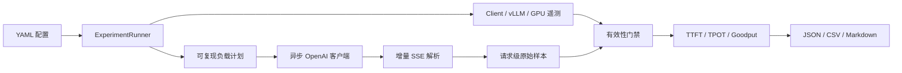

# InferScope

InferScope 是一个面向 SLO 的 LLM 推理压测、有效性验证与配置调优工具。它不是对
vLLM/GuideLLM 的复制，而是把“请求如何发出、流式时间如何记录、实验何时可信、
优化结论如何留证”实现成一条可审计流水线。

当前版本已经可以在 CPU 假服务端上完成端到端实验，并为 Linux + NVIDIA 单卡提供
保守的 vLLM/RTX 4060 配置。正式 GPU 性能结论仍必须在目标机器上运行后才能填写。

## 已实现能力

- 严格 YAML 配置、稳定配置哈希、环境指纹和安全结果目录；
- 自研增量 SSE 解析：跨网络分片 UTF-8、多事件同包、keep-alive、`[DONE]`；
- 异步 OpenAI-compatible 流式客户端，首个非空内容才触发 TTFT；
- 并发、固定速率、Poisson 和共享前缀负载，seed 可复现；
- TTFT、E2E、TPOT、chunk inter-arrival、吞吐和尾延迟；
- SLO Goodput、Pareto 前沿和重复实验稳定性；
- 预热、成功率、输出长度、时间完整性、客户端容量和 GPU 隔离门禁；
- vLLM Prometheus 指标映射、客户端 CPU/内存/event-loop lag、可选 NVML；
- 原始 JSONL、聚合 JSON/CSV 和证据优先 Markdown 报告；
- CPU fake server、RTX 4060 启动脚本与 85 个自动化测试。



## 5 分钟 CPU 冒烟实验

要求：Python 3.11 和 [uv](https://docs.astral.sh/uv/)。

```bash
uv sync --group dev

# 终端 1：启动不依赖模型/GPU 的确定性 SSE 服务
./scripts/serve_fake.sh

# 终端 2：探活并执行并发 1/2/4 三组实验
./scripts/run_smoke.sh
```

产物会写入：

```text
results/raw/<run_id>/
├── manifest.json
├── config.resolved.yaml
├── requests.jsonl
├── client_metrics.jsonl
├── server_metrics.jsonl
├── gpu_metrics.jsonl
└── validation.json

results/processed/<run_id>/
├── aggregate.json
└── summary.csv

reports/generated/<run_id>.md

results/charts/<matrix-run>.svg
```

原始请求只保存 prompt/response SHA-256，默认不保存正文。查看一次运行：

```bash
uv run inferscope benchmark show --run-id <run_id> --results-dir results
```

## RTX 4060 8GB 运行

推荐 Linux x86_64、可用的 NVIDIA 驱动和单独的 vLLM Python 环境。首个模型使用
`Qwen/Qwen2.5-0.5B-Instruct`，不要一开始上 7B，也不要同时运行 HF 和 vLLM 两份模型。

```bash
# GPU 环境中安装与驱动兼容的 vLLM；版本按该机器的 CUDA 组合确定
nvidia-smi
vllm --version

# 终端 1
./scripts/serve_vllm_4060.sh

# 终端 2
./scripts/run_4060.sh
```

4060 启动脚本默认：`max-model-len=4096`、`gpu-memory-utilization=0.80`、
`max-num-seqs=8`、`enforce-eager`。这是保守 bring-up 配置，不代表性能最优值。稳定后再
一次只修改一个变量，保存全部失败和成功 run，比较 Goodput 与 Pareto，而不是只截取
最好结果。

当前开发机是 macOS ARM64，没有 NVIDIA 驱动，因此本仓库只确认了 CPU 协议/逻辑和
端到端 fake-server 流程；CUDA、NVML 和真实 vLLM 数字尚未在本机验证。

## 本项目自己实现了什么

| 层 | 使用现有方案 | InferScope 的工作 |
| --- | --- | --- |
| 推理引擎 | vLLM / Transformers | 不重写 CUDA 推理引擎，提供实验控制与比较 |
| HTTP | httpx | 调度、并发、超时、证据保留和错误归一化 |
| SSE | 协议规范 | 字节级增量解析、TTFT 边界、异常断流处理 |
| 指标 | NumPy | 明确口径、完整测量窗口、缺失值不伪造为 0 |
| 遥测 | Prometheus / psutil / NVML | 版本容错映射、时间对齐和缺失能力声明 |
| 实验 | 借鉴 GuideLLM/AIPerf 方法 | 配置哈希、有效性门禁、Goodput/Pareto、可审计产物 |

因此面试中真正可讲的不是“我部署了 vLLM”，而是：为什么 SSE chunk 不能当 token、
TTFT 在哪里打点、为什么吞吐分母是测量窗口、压测客户端成为瓶颈时如何识别、哪些
实验不能用于宣称提升，以及每个结论如何追溯到 run ID。

## 开发门禁

```bash
uv run ruff format --check src tests
uv run ruff check src tests
uv run mypy src
uv run pytest -m "not gpu"
```

CPU 测试不会冒充 GPU 测试。真实 GPU 实验还需要记录 `nvidia-smi`、驱动、模型 revision、
vLLM 版本以及原始运行产物。

## 文档

- [AI Infra 学习路线](./AI_INFRA_LEARNING_ROADMAP.md)
- [项目立项总结](./PROJECT_PROPOSAL.md)
- [开发文档](./DEV_DOCUMENT.md)
- [API 与数据契约](./INFERSCOPE_API.md)
- [代码和实验规范](./INFERSCOPE_STYLE.md)

## 当前边界与下一步

当前已具备可运行 MVP。下一阶段按求职价值排序：

1. 在 RTX 4060 上完成 Qwen2.5-0.5B 的 3 次重复基线；
2. 增加参数扫描图表和跨 run 比较 CLI；
3. 加入 HF Transformers 基线服务，与 vLLM 做同口径对照；
4. 使用 GuideLLM 做一次交叉验证，解释差异而非追求数字完全相同；
5. 再做 prefix cache / chunked prefill 两个有诊断证据的优化实验。

没有对应原始 run ID 时，不在 README 或简历中填写性能提升数字。
