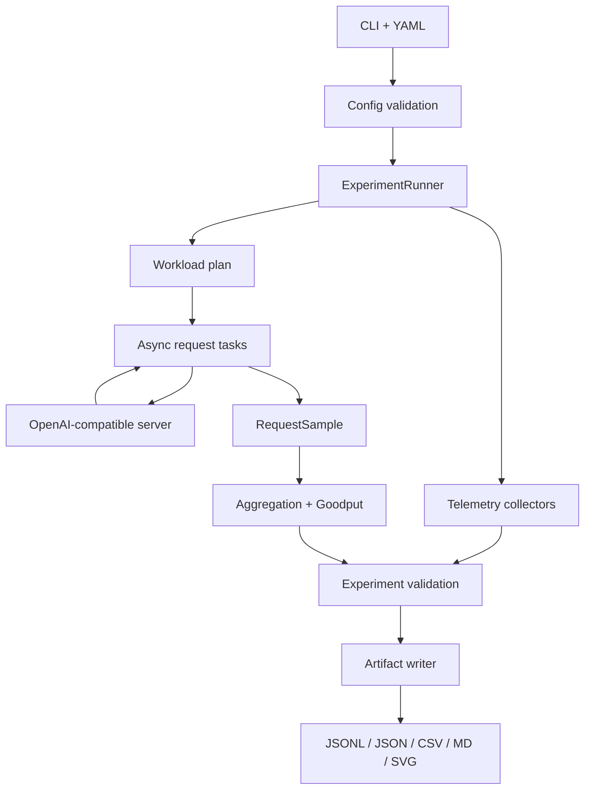

# InferScope 架构

本文只描述当前仓库已经存在的架构。尚未接线的 backend adapter、自动调优和 CI 放在
[项目立项与路线图](PROJECT_PROPOSAL.md)，不与现状混写。

## 1. 系统边界

InferScope 是推理服务之上的 benchmark harness：它生成负载、调用 OpenAI 兼容接口、测量
客户端时序、采集外部遥测、判断实验是否有效，并落盘证据。它不实现模型执行、CUDA kernel、
KV cache 或推理引擎调度。

## 2. 模块职责

| 模块 | 当前职责 | 关键边界 |
| --- | --- | --- |
| `cli.py` | `env`、`server`、`benchmark` 命令与退出码 | 不承载指标算法 |
| `config.py` | 严格解析 YAML、拒绝未知字段、限制结果目录 | 不自动修正错误实验 |
| `runner.py` | warmup、负载点执行、聚合、校验、写产物 | 当前只走 Chat Completions |
| `workloads/` | synthetic/shared-prefix prompt 与三种到达计划 | `mixed` 尚无独立实现 |
| `transport/` | 异步 HTTP、SSE 增量解析、请求时序 | 不负责业务重试和模型 tokenization |
| `metrics/` | 请求级 TTFT/TPOT/E2E 与运行级聚合 | 只计算，不决定实验有效性 |
| `analysis/` | Goodput、Pareto、重复实验稳定性 | Pareto/稳定性尚未接入 CLI |
| `telemetry/` | vLLM Prometheus、NVML、客户端 event-loop lag | 缺失信息必须显式表达 |
| `validators/` | 证据门禁与 VALID/INVALID/INCONCLUSIVE | 不把缺失证据当作通过 |
| `reporting/` | 结构化结果、Markdown、SVG | 报告是产物视图，不是事实源 |
| `artifacts.py` | 运行目录、原子写入、路径约束 | 防止结果写到项目外部 |
| `environment.py` | 无密钥环境与 Git 指纹 | 不采集凭据和 prompt 正文 |

## 3. 一次运行的数据流

1. CLI 读取 YAML，Pydantic schema 完成类型、枚举、范围和未知字段校验。
2. runner 对负载矩阵的每个值和每次 repeat 生成唯一 `run_id`。
3. 根据 `concurrency`、`fixed_rate` 或 `poisson` 生成到达计划。
4. 先执行 warmup；warmup 样本不进入正式聚合。
5. 正式请求按 offset 调度，transport 逐 chunk 消费 SSE，并记录单调时钟时间点。
6. 同期采集客户端 event-loop lag、可选 vLLM `/metrics` 和可选 NVML 数据。
7. 请求样本进入聚合器，得到百分位、吞吐和 Goodput。
8. validator 对计时、成功率、输出长度、token、event-loop lag 与 GPU 隔离证据执行门禁。
9. artifact writer 先写 raw evidence，再写 processed summary、报告和图表。
10. 任一运行不是 `VALID` 时，CLI 以退出码 `4` 结束，但保留已生成证据。

## 4. 时间与并发模型

请求级时延使用 `time.monotonic_ns()` 语义，避免墙上时钟校准造成负时延或跳变；UTC wall time
只用于跨文件定位和人类阅读。

- **闭环并发**：所有任务 offset 为零，由并发上限控制在途请求；一个完成后才补下一个。
- **固定速率**：按固定间隔安排开始时间；服务端变慢时可积累在途请求。
- **Poisson**：使用带 seed 的指数分布间隔，保证同一配置的到达计划可复现。

客户端采样任务通过一次预定的异步 sleep 测量 event-loop 额外延迟。若本机事件循环已经过载，
即便服务端返回成功，validator 也会给出 WARN，使运行成为 `INCONCLUSIVE`。

## 5. 流式请求状态机

SSE parser 支持 chunk 边界切开一行、一个事件包含多行 `data:`、注释行和 `[DONE]`。
transport 仅在收到首个非空 `delta.content` 时记录 first-content 时间，避免角色 chunk 被误认为
首 token。完成后形成包含开始、首内容、结束、文本和 usage token 数的流式结果。

当前没有本地 tokenizer，因此输入/输出 token 主要依赖响应 usage；缺失时必须由验证规则和报告
显式暴露，不能默认为零。

## 6. 状态机与证据等级

实验最终状态有三种主要语义：

| 状态 | 含义 |
| --- | --- |
| `VALID` | 所有必需门禁通过，可以进入性能比较 |
| `INVALID` | 已有证据证明实验违反门禁，例如成功率过低或计时不完整 |
| `INCONCLUSIVE` | 关键证据缺失，无法证明有效，也不能宣称失败性能 |

模型中还保留 `ABORTED` 枚举，但当前 runner 对中断的完整原子产物协议尚未实现。CLI 捕获键盘中断并
返回 `130`，不能宣称已经完成 aborted run 归档。

## 7. 产物合同

`raw/<run-id>` 是事实层：解析后配置、manifest、请求级 JSONL、三类遥测和验证报告。
`processed/<run-id>` 是派生层：aggregate 与 CSV。`reports/generated/<run-id>.md` 是人类报告，
`results/charts/*.svg` 是跨负载点可视化。

消费者应优先读取 JSON/JSONL，而不是从 Markdown 报告反向解析数据。任何对比都应先检查：

- 两次实验是否均为 `VALID`；
- 模型、引擎、量化、prompt/output token 目标是否一致；
- 环境指纹、GPU 状态、到达模型和测量窗口是否可比；
- 百分位样本量是否足够。

## 8. 当前架构缺口

- `backend` 还不是独立 adapter 接口，runner 固定调用 Chat Completions。
- Hugging Face baseline、`completions` 请求类型和 `mixed` workload 尚未接线。
- Pareto/stability 虽有纯函数与测试，但缺少 runner/CLI 的一等产物。
- GPU clean-room 只能基于现有证据判定；无证据会得到 `INCONCLUSIVE`。
- `/metrics` 不可用时仍需更清晰地落盘原因，避免遥测缺失被忽略。
- 中断恢复和部分产物的事务边界尚未形成完整设计。

指标与门禁细节见 [Benchmark 方法论](BENCHMARK_METHODOLOGY.md)，配置能力边界见
[配置与 CLI](CONFIGURATION.md)。
